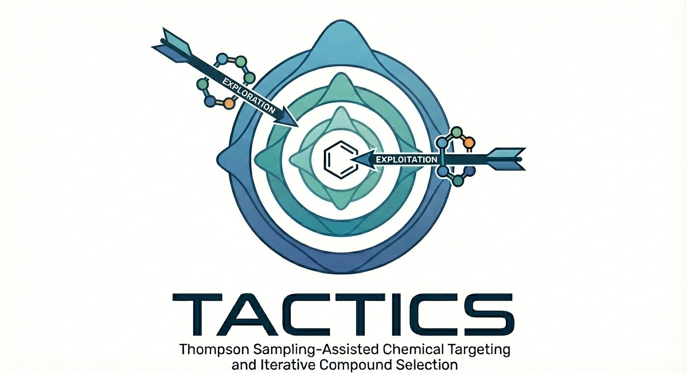

.. TACTICS documentation master file, created by
   sphinx-quickstart on Thu Apr 24 15:14:03 2025.
   You can adapt this file completely to your liking, but it should at least
   contain the root `toctree` directive.

Welcome to TACTICS documentation!
=================================

TACTICS (Thompson Sampling-Assisted Chemical Targeting and Iterative Compound Selection for Drug Discovery) is a comprehensive Python package for Thompson Sampling-based optimization of chemical combinatorial libraries with a unified, flexible architecture.

Key Features
------------

* **Unified Thompson Sampler**: Single sampler class that accepts different selection strategies
* **Multiple Selection Strategies**: Greedy, Roulette Wheel (thermal cycling), UCB, Epsilon-Greedy, Bayes-UCB
* **Flexible Warmup Strategies**: Balanced (recommended), Standard, Enhanced (legacy)
* **Multiple Evaluators**: Lookup, Database, Fingerprint, ML models, ROCS, FRED docking
* **Parallel Evaluation**: Built-in multiprocessing support for expensive evaluators
* **Pydantic Configuration**: Type-safe configuration with validation and presets
* **Configuration Presets**: Pre-configured setups for common use cases
* **Extensible Design**: Easy integration of custom strategies, warmup methods, and evaluators
* **Library Enumeration**: Efficient generation of combinatorial reaction products
* **SMARTS Toolkit**: Advanced pattern validation (``ReactionDef``), multi-SMARTS routing, and multi-step synthesis
* **Library Analysis**: Comprehensive analysis and visualization tools

Architecture Overview
---------------------

The following diagram shows how the main components of TACTICS work together:

.. graphviz::

    digraph TACTICS {
        rankdir=TB;
        node [shape=box, style="rounded,filled", fontname="Helvetica", fontsize=10];
        edge [fontname="Helvetica", fontsize=9];
        nodesep=0.2;
        ranksep=0.4;

        // Core TACTICS Engine at top
        TACTICS [label="TACTICS\nThompson Sampler", fillcolor="#FFD700", style="filled,bold,rounded"];

        // Three main pluggable components side by side
        subgraph cluster_plugins {
            label="Pluggable Components";
            style=filled;
            color="#F5F5F5";
            
            Strategies [label="Selection Strategy\n(5 options)", fillcolor="#FFB6C1"];
            Warmups [label="Warmup Strategy\n(3 options)", fillcolor="#00CED1"];
            Evaluators [label="Evaluator\n(7 options)", fillcolor="#DDA0DD"];
        }

        // Library Enumeration
        subgraph cluster_enum {
            label="Library Enumeration";
            style=filled;
            color="#F5F5F5";
            
            Pipeline [label="SynthesisPipeline", fillcolor="#DCDCDC"];
            ReactionDef [label="ReactionDef", fillcolor="#DCDCDC"];
        }

        // Configuration
        Config [label="ThompsonSamplingConfig\n(Pydantic v2)", fillcolor="#98FB98"];

        // Vertical flow
        Config -> TACTICS [style=bold];
        TACTICS -> Strategies;
        TACTICS -> Warmups;
        TACTICS -> Evaluators;
        TACTICS -> Pipeline [style=dashed];
    }

The diagram shows TACTICS as the central orchestrator that coordinates:

- **Selection Strategies**: Greedy, RouletteWheel, UCB, EpsilonGreedy, BayesUCB
- **Warmup Strategies**: Balanced (recommended), Standard, Enhanced
- **Evaluators**: Lookup, DB, Fingerprint, MW, ROCS, FRED, MLClassifier
- **Library Enumeration**: SynthesisPipeline with ReactionDef for product generation

Data Flow
---------

The Thompson Sampling optimization follows this workflow:

.. graphviz::

    digraph DataFlow {
        rankdir=TB;
        node [shape=box, style="rounded,filled", fontname="Helvetica", fontsize=10];
        edge [fontname="Helvetica", fontsize=9];
        nodesep=0.3;
        ranksep=0.4;

        Reagents [label="Reagent Files (.smi)", shape=folder, fillcolor="#ADD8E6"];
        Config [label="Configuration", fillcolor="#FFFACD"];
        Warmup [label="Warmup Phase\n(Initialize Priors)", fillcolor="#E0FFFF"];
        Search [label="Search Phase\n(Thompson Sampling)", fillcolor="#FFD700"];
        Evaluate [label="Evaluate\n(Score Compounds)", fillcolor="#E6E6FA"];
        Update [label="Update Posteriors\n(Bayesian)", fillcolor="#90EE90"];
        Results [label="Results DataFrame\n(Polars)", shape=cylinder, fillcolor="#ADD8E6"];

        Reagents -> Config;
        Config -> Warmup;
        Warmup -> Search;
        Search -> Evaluate;
        Evaluate -> Update;
        Update -> Search [label="iterate", style=dashed];
        Search -> Results [label="complete"];
    }

Quick Start
-----------

Simple Out-of-the-Box Usage (Recommended)
~~~~~~~~~~~~~~~~~~~~~~~~~~~~~~~~~~~~~~~~~~

The easiest way to get started with TACTICS is using the ``run_ts()`` convenience function with presets:

.. code-block:: python

    from TACTICS.library_enumeration import SynthesisPipeline
    from TACTICS.library_enumeration.smarts_toolkit import ReactionConfig, ReactionDef
    from TACTICS.thompson_sampling import run_ts, get_preset
    from TACTICS.thompson_sampling.core.evaluator_config import LookupEvaluatorConfig

    # 1. Create synthesis pipeline (single source of truth)
    rxn_config = ReactionConfig(
        reactions=[ReactionDef(
            reaction_smarts="[C:1](=O)[OH].[NH2:2]>>[C:1](=O)[NH:2]",
            step_index=0
        )],
        reagent_file_list=["acids.smi", "amines.smi"]
    )
    pipeline = SynthesisPipeline(rxn_config)

    # 2. Create evaluator config
    evaluator = LookupEvaluatorConfig(ref_filename="scores.csv")

    # 3. Get a preset configuration
    config = get_preset(
        "fast_exploration",  # Quick screening with epsilon-greedy
        synthesis_pipeline=pipeline,
        evaluator_config=evaluator,
        mode="minimize",  # Use "minimize" for docking scores
        num_iterations=1000
    )

    # 4. Run and get results (returns polars DataFrame)
    results_df = run_ts(config)

    # 5. Analyze top results
    print(results_df.sort("score").head(10))

**Available Presets:**

*Modern Presets* (use BalancedWarmup):

* ``fast_exploration`` - Epsilon-greedy strategy, quick screening
* ``parallel_batch`` - Batch processing with multiprocessing (for slow evaluators)
* ``conservative_exploit`` - Greedy strategy, focus on best reagents
* ``balanced_sampling`` - UCB strategy with theoretical guarantees
* ``diverse_coverage`` - Maximum diversity exploration

*Legacy Presets* (for replicating published RWS results):

* ``legacy_rws_maximize`` - Original RWS algorithm with Boltzmann weighting (maximize mode)
* ``legacy_rws_minimize`` - Original RWS algorithm with Boltzmann weighting (minimize mode, e.g., docking)

Parallel Batch Processing
~~~~~~~~~~~~~~~~~~~~~~~~~~

For expensive evaluators (docking, ML models), use parallel batch mode:

.. code-block:: python

    from TACTICS.library_enumeration import SynthesisPipeline
    from TACTICS.library_enumeration.smarts_toolkit import ReactionConfig, ReactionDef
    from TACTICS.thompson_sampling import run_ts, get_preset
    from TACTICS.thompson_sampling.core.evaluator_config import FredEvaluatorConfig

    # Create synthesis pipeline
    rxn_config = ReactionConfig(
        reactions=[ReactionDef(
            reaction_smarts="[C:1](=O)[OH].[NH2:2]>>[C:1](=O)[NH:2]",
            step_index=0
        )],
        reagent_file_list=["acids.smi", "amines.smi"]
    )
    pipeline = SynthesisPipeline(rxn_config)

    # Configure slow evaluator (molecular docking)
    evaluator = FredEvaluatorConfig(design_unit_file="receptor.oedu")

    # Get parallel batch preset
    config = get_preset(
        "parallel_batch",
        synthesis_pipeline=pipeline,
        evaluator_config=evaluator,
        mode="minimize",  # Docking scores (lower is better)
        batch_size=100    # Sample 100 compounds per cycle
    )

    results_df = run_ts(config)

Custom Configuration
~~~~~~~~~~~~~~~~~~~~

For full control over all parameters:

.. code-block:: python

    from TACTICS.library_enumeration import SynthesisPipeline
    from TACTICS.library_enumeration.smarts_toolkit import ReactionConfig, ReactionDef
    from TACTICS.thompson_sampling import ThompsonSamplingConfig, run_ts
    from TACTICS.thompson_sampling.strategies.config import RouletteWheelConfig
    from TACTICS.thompson_sampling.warmup.config import BalancedWarmupConfig
    from TACTICS.thompson_sampling.core.evaluator_config import LookupEvaluatorConfig

    # Create synthesis pipeline
    rxn_config = ReactionConfig(
        reactions=[ReactionDef(
            reaction_smarts="[C:1](=O)[OH].[NH2:2]>>[C:1](=O)[NH:2]",
            step_index=0
        )],
        reagent_file_list=["acids.smi", "amines.smi"]
    )
    pipeline = SynthesisPipeline(rxn_config)

    # Create fully customized configuration
    config = ThompsonSamplingConfig(
        synthesis_pipeline=pipeline,
        num_ts_iterations=5000,
        num_warmup_trials=5,
        strategy_config=RouletteWheelConfig(
            mode="maximize",
            alpha=0.1,  # Initial heating temperature
            beta=0.1,   # Initial cooling temperature
        ),
        warmup_config=BalancedWarmupConfig(
            observations_per_reagent=5,
            use_per_reagent_variance=True,
        ),
        evaluator_config=LookupEvaluatorConfig(
            ref_filename="scores.csv",
            score_col="binding_affinity"
        ),
        batch_size=10,
        results_filename="my_results.csv",
        log_filename="optimization.log"
    )

    results_df = run_ts(config)

Advanced Usage: Direct Sampler Control
~~~~~~~~~~~~~~~~~~~~~~~~~~~~~~~~~~~~~~~

For maximum flexibility, use ``ThompsonSampler`` directly:

.. code-block:: python

    from TACTICS.library_enumeration import SynthesisPipeline
    from TACTICS.library_enumeration.smarts_toolkit import ReactionConfig, ReactionDef
    from TACTICS.thompson_sampling import ThompsonSampler
    from TACTICS.thompson_sampling.presets import get_preset
    from TACTICS.thompson_sampling.core.evaluator_config import LookupEvaluatorConfig

    # Create synthesis pipeline
    rxn_config = ReactionConfig(
        reactions=[ReactionDef(
            reaction_smarts="[C:1](=O)[OH].[NH2:2]>>[C:1](=O)[NH:2]",
            step_index=0
        )],
        reagent_file_list=["reagents1.smi", "reagents2.smi"]
    )
    pipeline = SynthesisPipeline(rxn_config)

    # Use a preset configuration
    config = get_preset(
        "balanced_sampling",
        synthesis_pipeline=pipeline,
        evaluator_config=LookupEvaluatorConfig(ref_filename="scores.csv")
    )

    # Create sampler from config
    sampler = ThompsonSampler.from_config(config)

    # Run optimization with full control
    warmup_results = sampler.warm_up(num_warmup_trials=config.num_warmup_trials)
    print(f"Warmup completed: {len(warmup_results)} compounds evaluated")

    search_results = sampler.search(num_cycles=config.num_ts_iterations)
    print(f"Search completed: {len(search_results)} unique compounds")

    # Cleanup multiprocessing resources
    sampler.close()

Multi-SMARTS Routing Example
~~~~~~~~~~~~~~~~~~~~~~~~~~~~

For reactions requiring multiple SMARTS patterns (e.g., primary vs secondary amines),
use ``SynthesisPipeline.from_alternatives()``:

.. code-block:: python

    from TACTICS.thompson_sampling import ThompsonSamplingConfig, run_ts
    from TACTICS.thompson_sampling.strategies.config import RouletteWheelConfig
    from TACTICS.thompson_sampling.core.evaluator_config import LookupEvaluatorConfig
    from TACTICS.library_enumeration import SynthesisPipeline

    # Create pipeline with alternative SMARTS patterns
    pipeline = SynthesisPipeline.from_alternatives(
        primary_smarts="[C:1](=O)[OH].[NH2:2]>>[C:1](=O)[NH:2]",
        alternatives={
            "secondary_amine": "[C:1](=O)[OH].[NH:2]>>[C:1](=O)[N:2]"
        },
        reagent_files=["acids.smi", "amines.smi"],
        auto_detect=True  # Auto-detect reagent compatibility
    )

    # Create Thompson Sampling config with synthesis_pipeline
    config = ThompsonSamplingConfig(
        synthesis_pipeline=pipeline,
        num_ts_iterations=1000,
        strategy_config=RouletteWheelConfig(mode="maximize"),
        evaluator_config=LookupEvaluatorConfig(ref_filename="scores.csv"),
    )

    results_df = run_ts(config)

Installation
------------

.. code-block:: bash

    # Basic installation
    pip install -e .

    # With test dependencies
    pip install -e ".[test]"

    # With Jupyter notebook support
    pip install -e ".[notebook]"

Requirements
~~~~~~~~~~~~

* Python 3.11+
* RDKit for molecular operations
* Polars for efficient data handling
* Pydantic v2 for configuration validation

Optional dependencies:

* OpenEye Toolkit for ROCS and FRED evaluators
* scikit-learn for ML classifier evaluator

.. toctree::
   :maxdepth: 2
   :caption: Contents:

   thompson_sampling
   configuration
   library_enumeration
   library_analysis

Indices and tables
==================

* :ref:`genindex`
* :ref:`modindex`
* :ref:`search`

