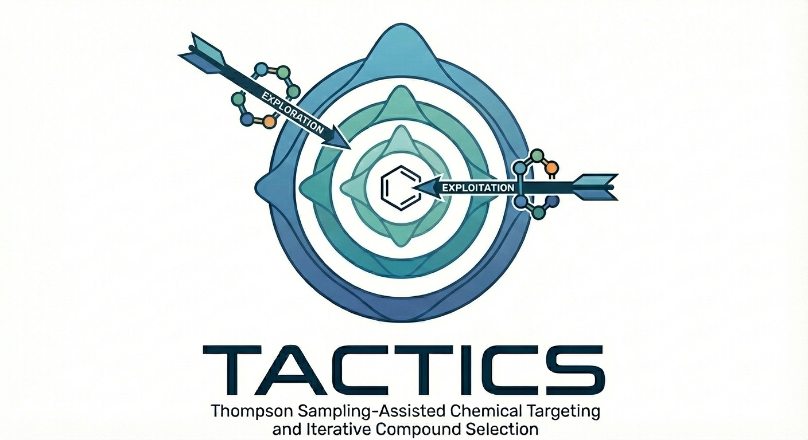

.. TACTICS documentation master file

Welcome to TACTICS documentation!
=================================

TACTICS (Thompson Sampling-Assisted Chemical Targeting and Iterative Compound Selection)
is a Python library for Thompson Sampling-based optimization of chemical combinatorial
libraries for drug discovery.

Key Features
------------

* **Best-in-class defaults**: ``get_preset()`` gives you the best-performing method out of the box (86.1% top-100 recovery across 21 libraries)
* **Pluggable Selection Strategies**: TopTwo (recommended), RouletteWheel/CATS, Greedy, UCB, Epsilon-Greedy, Bayes-UCB
* **Warmup Strategies**: Enhanced (recommended), Balanced, Standard
* **Multiple Evaluators**: Lookup, Database, Fingerprint, ML models, ROCS, FRED docking
* **Parallel Evaluation**: Built-in multiprocessing support for expensive evaluators
* **Pydantic Configuration**: Type-safe configuration with validation and presets
* **Library Enumeration**: Efficient generation of combinatorial reaction products via ``SynthesisPipeline``
* **SMARTS Toolkit**: Pattern validation (``ReactionDef``), multi-SMARTS routing, multi-step synthesis
* **Library Analysis**: Comprehensive analysis and visualization tools

Quick Start
-----------

Install TACTICS and run your first optimization in 10 lines:

.. code-block:: bash

    pip install chem-tactics

.. code-block:: python

    from TACTICS.library_enumeration import SynthesisPipeline
    from TACTICS.library_enumeration.smarts_toolkit import ReactionConfig, ReactionDef
    from TACTICS.thompson_sampling import ThompsonSampler, get_preset
    from TACTICS.thompson_sampling.core.evaluator_config import LookupEvaluatorConfig

    # 1. Define your reaction and reagents
    pipeline = SynthesisPipeline(ReactionConfig(
        reactions=[ReactionDef(
            reaction_smarts="[C:1](=O)[OH].[NH2:2]>>[C:1](=O)[NH:2]",
            step_index=0
        )],
        reagent_file_list=["acids.smi", "amines.smi"]
    ))

    # 2. Get the recommended configuration (Top-Two TS + Enhanced warmup)
    config = get_preset(
        synthesis_pipeline=pipeline,
        evaluator_config=LookupEvaluatorConfig(ref_filename="scores.csv"),
    )

    # 3. Run optimization
    sampler = ThompsonSampler.from_config(config)
    warmup_df = sampler.warm_up(num_warmup_trials=config.num_warmup_trials)
    results_df = sampler.search(num_cycles=config.num_ts_iterations)
    sampler.close()

That's it. The default ``"recommended"`` preset uses the best-performing method
from large-scale benchmarking. See the :doc:`strategies` guide to understand
what's happening under the hood and when to customize.

Architecture Overview
---------------------

.. graphviz::

    digraph TACTICS {
        rankdir=TB;
        node [shape=box, style="rounded,filled", fontname="Helvetica", fontsize=10];
        edge [fontname="Helvetica", fontsize=9];
        nodesep=0.2;
        ranksep=0.4;

        TACTICS [label="TACTICS\nThompson Sampler", fillcolor="#FFD700", style="filled,bold,rounded"];

        subgraph cluster_plugins {
            label="Pluggable Components";
            style=filled;
            color="#F5F5F5";

            Strategies [label="Selection Strategy\n(6 options)", fillcolor="#FFB6C1"];
            Warmups [label="Warmup Strategy\n(3 options)", fillcolor="#00CED1"];
            Evaluators [label="Evaluator\n(7 options)", fillcolor="#DDA0DD"];
        }

        subgraph cluster_enum {
            label="Library Enumeration";
            style=filled;
            color="#F5F5F5";

            Pipeline [label="SynthesisPipeline", fillcolor="#DCDCDC"];
            ReactionDef [label="ReactionDef", fillcolor="#DCDCDC"];
        }

        Config [label="ThompsonSamplingConfig\n(Pydantic v2)", fillcolor="#98FB98"];

        Config -> TACTICS [style=bold];
        TACTICS -> Strategies;
        TACTICS -> Warmups;
        TACTICS -> Evaluators;
        TACTICS -> Pipeline [style=dashed];
    }

The diagram shows TACTICS as the central orchestrator that coordinates:

- **Selection Strategies**: TopTwo (recommended), RouletteWheel/CATS, Greedy, UCB, EpsilonGreedy, BayesUCB
- **Warmup Strategies**: Enhanced (recommended), Balanced, Standard
- **Evaluators**: Lookup, DB, Fingerprint, MW, ROCS, FRED, MLClassifier
- **Library Enumeration**: SynthesisPipeline with ReactionDef for product generation

Installation
------------

.. code-block:: bash

    # Basic installation
    pip install chem-tactics

    # Development install (from source)
    pip install -e .

    # With test dependencies
    pip install -e ".[test]"

    # With tutorial notebooks (marimo)
    pip install -e ".[tutorials]"

Requirements
~~~~~~~~~~~~

* Python 3.11+
* RDKit for molecular operations
* Polars for efficient data handling
* Pydantic v2 for configuration validation

Optional dependencies:

* OpenEye Toolkit for ROCS and FRED evaluators
* scikit-learn for ML classifier evaluator

.. toctree::
   :maxdepth: 2
   :caption: User Guide

   strategies

.. toctree::
   :maxdepth: 2
   :caption: Reference

   thompson_sampling
   configuration
   library_enumeration
   library_analysis

Indices and tables
==================

* :ref:`genindex`
* :ref:`modindex`
* :ref:`search`
